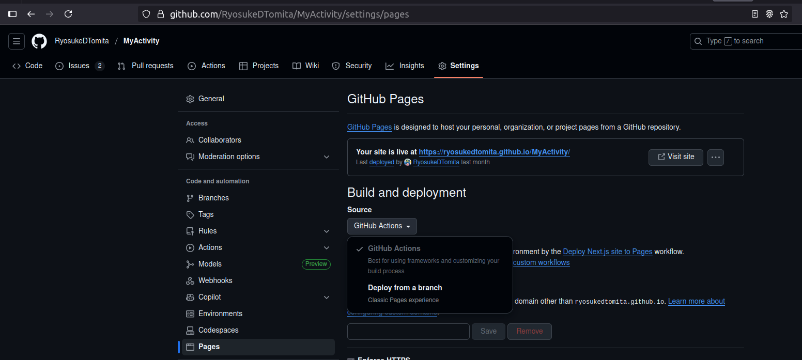
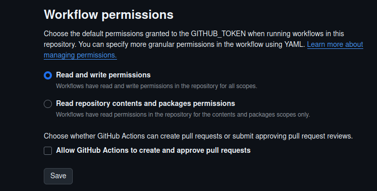

# My Activity Web site with GitHub Pages


## INDEX

- [ABOUT](#about)
- [ENVIRONMENT](#environment)
- [PREPARING](#preparing)
- [HOW TO USE](#how-to-use)

---

## ABOUT

A personal profile site originally created with Vibe Coding, now refined and improved.

https://ryosukedtomita.github.io/MyActivity/

---

## ENVIRONMENT

- [Next.js](https://nextjs.org/)
- TypeScript
- Tailwind CSS
- Framer Motion
- Lucide React

---

## PREPARING

### Local environment

```shell
cd MyActivity
npm install
```

```shell
npm run dev
```

go to http://localhost:3000/MyActivity/


### GitHub settings

1. GitHub Pages --> Build and deployment --> SourceをGitHub Actionsに
    
2. Actions --> Workflow permissions --> Read and write permissions
    

### Deploy to GitHub Pages via GitHub Actions

1. push to main branch
2. go to https://ryosukedtomita.github.io/MyActivity/

---

## HOW TO USE

Edit `MyActivity/src/app/page.tsx`
